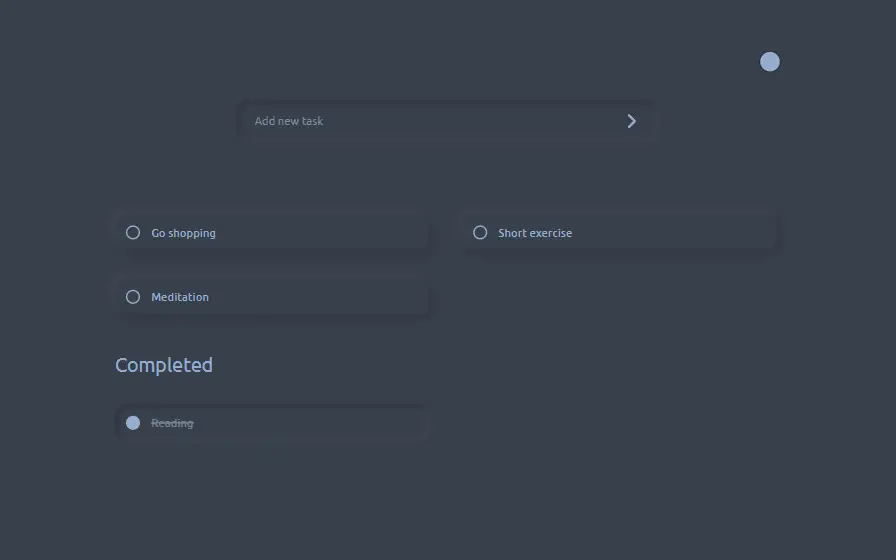
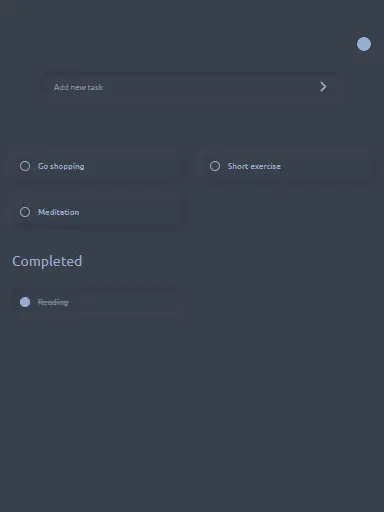
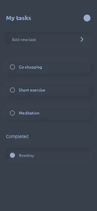

# Technical test
### [Visita la pagina web aqui](https://nestorrig.github.io/technical-test/)

## Reto
Desarrollar una página web de una lista de tareas, deberá cumplir con las
siguientes funciones:
1. Dar de alta tareas: La tarea se escribe en el cuadro de texto superior.
Al dar tap en el > o enter en teclado se agrega a la lista.
2. Lista de tareas: Se compone de las tareas que el usuario vaya
agregando.
3. Tareas completadas: Al dar tap en el checker de completado
(círculo de cada tarea), la tarea se subraya y pasa a la lista de
completados.

### Aqui un ejemplo
> 
## Responsividad
El proyecto cuenta con un diseño responsivo que le permite adaptarse a cualquier dispositivo.
### Version desktop

### Version tablet

### Version mobile

---
## Detalles extra
Se han agregado algunos features adicionales, destacan los siguientes dos:

### 1. Custom colors
Puedes decidir un color de preferencia para el sitio:
>  

### 2. Placeholder estilo Google
Un placeholder dinamico que sube a la parte superior del input cuando se empieza a escribir y regresa a su position original cuando se crea la tarea.
> 